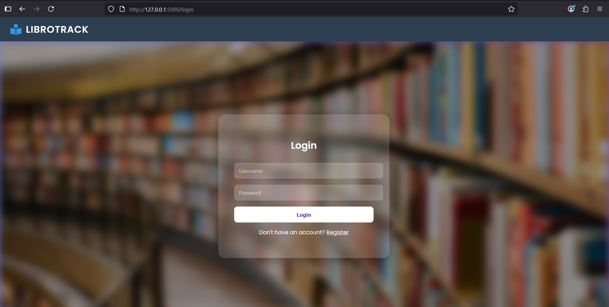
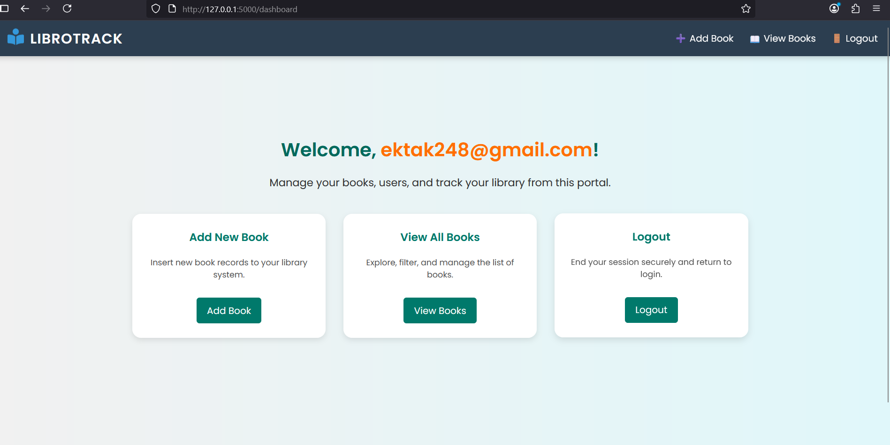
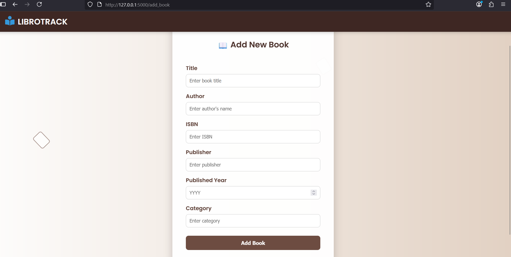
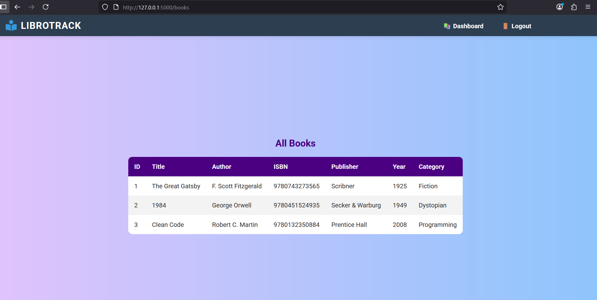
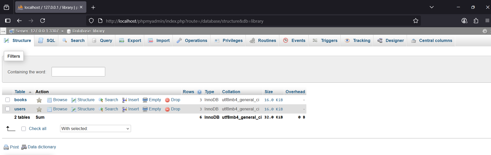
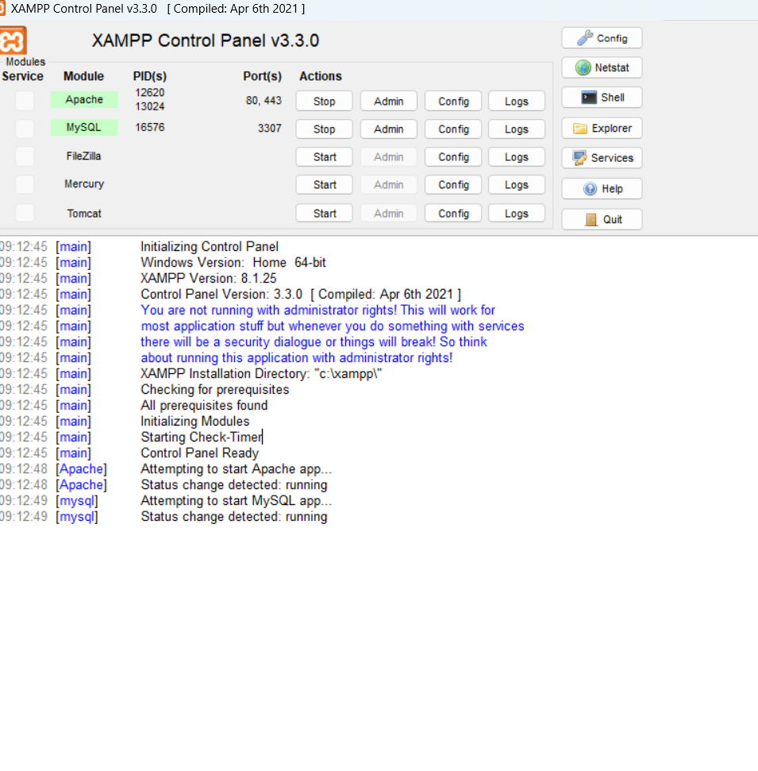

 Library Management System


This project is a Library Management System built using Flask (Python), MySQL, HTML, and CSS.
It is designed to help manage library operations such as user registration, login
adding books, and viewing available books.

---

Features
* User registration and login system with session management.
* Ability to add books with details such as title, author, ISBN, publisher, year, and category.
* Display of all books in a structured and user-friendly interface.
* Secure logout functionality to prevent unauthorized access.
* Modern and responsive UI with CSS styling.
* Database integration with MySQL for data persistence.

---

 Technology Stack
    Frontend HTML, CSS
    Backend Python (Flask)
    Database: MySQL
    Version Control: Git, GitHub

---

 Project Structure


library-management-system/
│
├── app.py                     # Main application file
├── config.py                  # Database configuration file
├── db/
│   └── schema.sql             # SQL schema for database setup
├── static/
│   └── Styles/                # CSS files
│       ├── login.css
│       ├── register.css
│       ├── dashboard.css
│       ├── view_books.css
│       └── add_book.css
├── templates/                 # HTML templates
│   ├── login.html
│   ├── register.html
│   ├── dashboard.html
│   ├── view_books.html
│   └── add_book.html
└── README.md


 Installation

1. Clone this repository:

   ```bash
   git clone https://github.com/Ekatak/library-management-system.git
   ```
2. Navigate to the project folder:

   ```bash
   cd library-management-system
   ```
3. Install dependencies:

   ```bash
   pip install flask mysql-connector-python
   ```
4. Set up the database:
   mysql -u root -p < db/schema.sql

5. Run the application:
   python app.py
   
6. Open the application in your browser at:
   http://127.0.0.1:5000
   

Screenshots:
## Screenshots

### Login Page


### Dashboard


### Add Book


### View Books


### Front Page
.png)

### Database


### XAMPP



